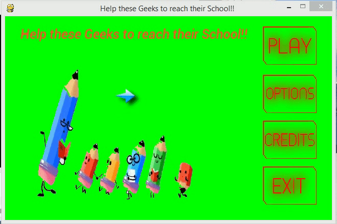

# Pencil-Run

The Pencil-Run is Race Game created using Google doodles little student pencil animations for Teacher’s Day 2016. The animation shows a five pencils, where one of them represents a teacher, wearing spectacles and reading a book, while four other little student pencils can be seen walking behind the teacher with much enthusiasm.

 
## Dependencies

At the time of development following python and pygame version are used.
* [python](https://www.python.org/)
    * Install Python version v3.2
        * Visit official website and "Install"
        * open python IDLE and type help()
        * make sure the version shows as 3.2
* [pygame](http://pygame.org/)
    * Install Pygame version v1.9.2a0
        * Visit official website and "Install"
        * open python IDLE and type import pygame
        * make sure no error message pop-ups

#### Steps to run the Game
 * make sure both python and pygame are installed and working fine.
 * open the Pencil-Run application and run controller.py.
